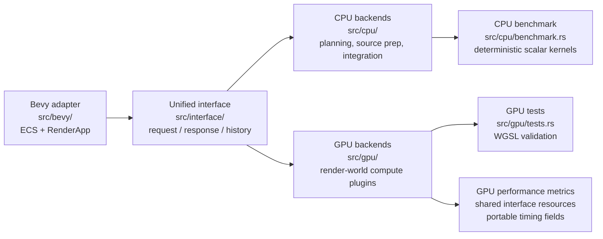
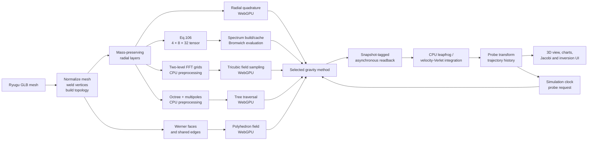
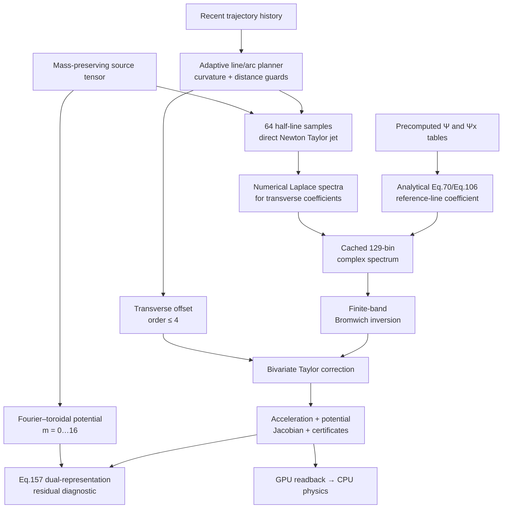

# Ryugu WASM

[](https://tom-jim.github.io/RyuGu_WASM/)


An experimental browser-based simulator for gravitational-field evaluation and spacecraft trajectories around asteroid (162173) Ryugu. The project is written in Rust with Bevy, compiled to WebAssembly, and uses WebGPU for field evaluation.

The repository compares five forward models and contains a research implementation of the near-straight-trajectory formulation called **Equation (106)** in [`mathpub.pdf`](mathpub.pdf). Equation (106) is still an exploratory numerical method: the current implementation is discretized, finite-band, and validated only within the tests and diagnostics described below.

> **Scope:** research prototype and synthetic-data demonstrator. It is not flight software, an orbit-determination product, or evidence of a proven performance advantage over established solvers.

[Open the live WebGPU demo](https://tom-jim.github.io/RyuGu_WASM/)


| **Orbital Trajectory** | **ProbeView** |
| :---: | :---: |
|  |  |
| **Change Orbit** | **Change Algorithm** |
|  |  |

## What is implemented

The simulator exposes five switchable gravity methods. Four use the same mass-normalized heterogeneous radial profile,

$$
\rho(r)=C\ln\left(1+\frac{r}{10\,\mathrm m}\right),
$$

while the Werner–Scheeres model is a homogeneous reference.

| UI method | Source preparation | Runtime evaluation | Main qualification |
|---|---|---|---|
| **GPU Radial Analytic** | The star-shaped mesh is divided into four equal-volume radial layers per angular cell; layer masses are integrated analytically. | WebGPU evaluates the field with eight-node Gauss–Legendre radial quadrature. | A direct heterogeneous reference. The mass integration is analytic, but the field evaluation is quadrature rather than a closed-form solver. |
| **GPU Werner Polyhedron** | CPU constructs oriented faces, shared edges, and geometric dyads. | WebGPU evaluates the homogeneous closed-polyhedron formula. | Homogeneous only; unusable boundary or non-manifold edge records are skipped and reported during preprocessing. |
| **Eq.106 Adaptive Curved-Arc** | The shared `4 × 8 × 32 = 1024` source aggregation, special-function tables, and trajectory segments are prepared. | WebGPU builds and caches transformed line spectra, then evaluates acceleration, potential, and a local Jacobian. | Experimental hybrid realization of Eq.106; most useful when many samples reuse a geometrically guarded near-straight segment. |
| **Common source discretization** | The original `786432` radial records are mass-preservingly aggregated into the same `1024` point sources. | Radial, Eq.106, the FFT-grid path, and the treecode consume this identical source set for method-to-method comparisons. | Werner remains a separate homogeneous closed-polyhedron reference. |
| **CPU FFT Grid + GPU Interpolation** | CPU performs a zero-padded Newton-kernel FFT convolution on two grids (`64³` and `16³`). | WebGPU samples the cached potential fields with tricubic interpolation and differentiates the interpolant. | This is CPU FFT preprocessing plus GPU interpolation, not an end-to-end GPU MMFFT implementation. Accuracy depends on grid spacing, interpolation, and boundary coverage. |
| **GPU Order-2 Octree Treecode** | CPU builds a fixed-depth octree and order-two multipole hierarchy. | WebGPU traverses the tree; accepted far cells use multipoles, while non-separated leaves use direct P2P. | This is a Barnes-Hut-style treecode, not a complete P2M/M2M/M2L/L2L/L2P FMM. |

## Mathematical core of Equation (106)

### 1. Newtonian starting point

For source point $\mathbf p$, observation point $\mathbf q$, and $R=\lVert\mathbf p-\mathbf q\rVert$, the positive gravitational potential and acceleration convention used by the project is

$$
U(\mathbf q)=G\iiint_V\frac{\rho(\mathbf p)}{R}\,dV',
\qquad
\mathbf g(\mathbf q)=G\iiint_V\rho(\mathbf p)
\frac{\mathbf p-\mathbf q}{R^3}\,dV'.
$$

The volume density is represented in source-centered spherical coordinates, so

$$
dV'=\lambda^2\sin\theta'\,d\lambda\,d\theta'\,d\phi'.
$$

### 2. Straight-reference-line transform

Around a chosen reference line, write the transverse source–line distance as $a$ and the signed longitudinal source coordinate as $z'$. For $\mathrm{Re}(s)>0$, define

$$
F(s;a,z')=\int_0^\infty
\frac{e^{-sh}}{\sqrt{a^2+(h-z')^2}}\,dh.
$$

The boundary identity

$$
\frac{\partial F}{\partial z'}=-sF+\frac{1}{R_0},
\qquad R_0=\sqrt{a^2+z'^2},
$$

is essential: the $1/R_0$ term is the endpoint contribution from the half-line and must not be discarded.

Introduce

$$
x=as,\qquad \eta=\frac{z'}a,\qquad \Psi(x,\eta)=F(s;a,z'),
$$

and the two dimensionless kernels

$$
K_V=x\Psi-\frac{1}{\sqrt{1+\eta^2}},
$$

$$
K_H=x\frac{\partial\Psi}{\partial x}
+\eta x\Psi-\frac{\eta}{\sqrt{1+\eta^2}}.
$$

Express the source point in the local frame of the reference line as $(r'_\perp,\phi',z')$. With $\Delta\phi=\phi-\phi'$, its transverse separation from the line is

$$
a^2=\varrho^2+r_\perp'^2-2\varrho r'_\perp\cos\Delta\phi
$$

and the transformed straight-line acceleration used as the Eq.106 reference coefficient is

$$
\widetilde{\mathbf g}(s)=G\iiint
\rho(\lambda,\theta',\phi')\lambda^2\sin\theta'
\left[
\mathbf e_\varrho
\frac{\varrho-r'_\perp\cos\Delta\phi}{a^2}K_H
+\mathbf e_\phi
\frac{r'_\perp\sin\Delta\phi}{a^2}K_H
+\mathbf e_z\frac{1}{a}K_V
\right]
\,d\lambda\,d\theta'\,d\phi'.
$$

In the mathematical note this expression first appears as Eq.70 and is later carried into the formulation labelled Eq.106. Apparent singular factors at $a\to0$ require the dedicated axis continuation implemented in the shader; arbitrary softening is not part of this derivation.

### 3. Curved-trajectory continuation

For a trajectory written as a reference-line point plus a transverse offset,

$$
\mathbf q(t)=\bar{\mathbf q}(h(t))+\delta\mathbf q(t),
$$

the field is locally continued with the translation operator

$$
\mathbf g(\bar{\mathbf q}+\delta\mathbf q)=\sum_{n=0}^{A}\frac{1}{n!}\left(\delta\mathbf q\cdot\nabla\right)^n\mathbf g(\bar{\mathbf q})+\mathbf R_{A+1}.
$$

The production path uses a bivariate transverse Taylor polynomial through total order **four** (`15` coefficients), not an unlimited or eighth-order expansion. The planner monitors a conservative distance ratio $\varepsilon$ and a geometric-series remainder estimate. A segment must be rebuilt or rejected when its curvature or source proximity exceeds the configured guard.

### 4. How the code realizes the formula

The current shader is a hybrid analytical/numerical realization:

1. A new line segment traverses the discrete source tensor at `64` half-line quadrature nodes.
2. Direct Newton samples generate the transverse Taylor coefficients.
3. Those coefficient samples are transformed numerically into `129` signed complex-frequency bins.
4. The zeroth, reference-line coefficient is overwritten by the analytical Eq.70/Eq.106 kernel evaluated from precomputed $\Psi$ and $\partial_x\Psi$ tables.
5. A finite-band Bromwich sum reconstructs the field, after which the transverse polynomial supplies the curved-arc correction.
6. The resulting acceleration, potential, local Jacobian, and diagnostic values are read back asynchronously. CPU physics then advances the trajectory.

Consequently, the implementation should not be described as an exact closed-form evaluation of every curved-trajectory coefficient. Its intended computational opportunity is **segment reuse**: building a new spectrum is expensive, but repeated evaluations on a valid cached segment avoid a fresh source traversal.

## Runtime architecture

### Software architecture and dependency direction

The Rust code is organized around one-way dependencies. Bevy owns scheduling,
render extraction, assets, and presentation; numerical backends do not reach
back into Bevy systems. Both CPU and GPU paths exchange the same snapshot and
field-sample contract through `src/interface/`.



The four top-level layers are intentionally directional:

```text
src/bevy/      Bevy scheduling, render extraction, scene, UI, and diagnostics
src/interface/ shared resources, snapshots, histories, and method selection
src/cpu/       trajectory planning, source preparation, integration, inversion,
               Eq.106 reference operators, and CPU benchmark entry points
src/gpu/       WebGPU compute backends, shader validation tests, and portable
               performance metric collection
```

There are no compatibility redirect modules in the runtime. Imports point
directly from Bevy adapters to the shared interface and then to CPU or GPU
implementations. The Eq.106 dispatch path is split into named preparation,
trajectory-batch, sensitivity-matrix, single-target, and layout stages; no
scheduling order, buffer contract, or physics fallback behavior changes.

The benchmark entry point is exported from `src/cpu/benchmark.rs` rather than
the Bevy application entry point. This keeps host/WASM benchmark tooling
independent from window creation while preserving the public
`benchmark_gravity_algorithms(iterations)` export.



The browser has no automatic CPU fallback for the real-time gravity path. If a valid WebGPU evaluator or matching field sample is unavailable, trajectory advancement pauses rather than silently switching algorithms.

## Equation (106) segment pipeline



## Diagnostics and density inversion

### Rotating-frame Jacobi diagnostic

For body-frame position $\mathbf r$, velocity $\mathbf v_{\rm rot}$, spin $\boldsymbol\omega$, and positive potential $U$, the displayed quantity is

$$
C_J=2U+\lVert\boldsymbol\omega\times\mathbf r\rVert^2
-\lVert\mathbf v_{\rm rot}\rVert^2.
$$

Its relative drift is a consistency diagnostic for the coupled force, potential, frame transformation, readback, and time integrator. A flat curve does not by itself prove that a gravity model is physically correct; a drift can come from field approximation, stale GPU data, interpolation, or integration error.

### Dual-representation residual

Eq.106 also compares its curve-integrated potential change with a truncated Fourier–toroidal potential representation (`m = 0…16`). This is useful for detecting disagreement between two numerical representations, but the two paths share the same density model. The residual is therefore not an independent physical measurement or a proof of density identifiability.

### Synthetic density inversion

The interactive inversion freezes one immutable capture before comparing methods:

- `16` editable position, velocity, orientation, and time knots define a continuous quintic-Hermite track sampled at the same `241` points by every method;
- one `capture_id` identifies that complete sample array, and the UI rejects result rows from a different capture;
- the synthetic observation vector is generated at all 241 training states from all `786432` logarithmic-density radial records by an independent `f64` order-two tree with a strict `0.025` opening tolerance; the result is cached by `capture_id` and source hash, so every inverse backend receives identical observations without repeating the high-resolution build;
- the Quintic Hermite sampler evaluates position, its analytic time derivative, and acceleration from the same polynomial; editing a knot changes the capture identity and regenerates both the matrix geometry and observations;
- validation uses a separate body-frame-offset holdout arc that is never included in the QP; its predictions use unit-density bases assembled from the original radial records rather than voxel-centroid kernels;
- the interior is represented by a `4³` Cartesian grid (`56` occupied voxels for the bundled model);
- the `1024` mass-preserving aggregated sources are assigned once to those 56 voxels and normalized to unit-density voxel volume; Eq.106, MMFFT, and the treecode consume the identical source positions, volumes, column ownership, and frozen target array;
- each inverse backend supplies a unit-density response matrix `A` for the same 723-component acceleration vector; forward models never predict density directly, and Clarabel solves for the 56 density variables;
- Eq.106 builds all 56 unit-density voxel columns in one GPU command encoder, submits once, and reads one compact acceleration-only matrix back once; Jacobian, residual, dual-certificate, and timestamp-query output is disabled for this inversion-only path;
- the Eq.106 matrix cache identity combines the frozen `capture_id`, source geometry hash, shared basis hash, voxel/sample dimensions, and a frequency/quadrature/Taylor configuration signature; a density update reuses the geometry operator instead of rebuilding it;
- MMFFT builds each column with its real CIC deposition, zero-padded FFT convolution, hierarchy selection, and tricubic derivative rather than a softened Newton substitute;
- one cold MMFFT matrix build now creates each level's Newton kernel spectrum once, reuses cached forward/inverse RustFFT plans and scratch storage, performs the convolution in a reusable `Complex64` density buffer, and skips hierarchy levels unused by the frozen target array. The numerical precision and `64³`/`16³` grids are unchanged;
- the third inversion row is explicitly a CPU `f64` quadrupole treecode using the shared distributed basis. It is distinct from the runtime GPU order-two treecode;
- MMFFT and treecode matrices are cached by `capture_id`, source hash, shared basis hash, and sample count, matching the Eq.106 warm-reuse semantics;
- Rust assembles the shared `56 × 56` convex QP and Clarabel solves it with exact total-mass equality, density bounds, spatial and radial smoothness, and a weak uniform prior.
- the data term uses an explicit diagonal covariance (`0.1%` relative acceleration noise with an absolute floor) instead of implicit per-sample normalization; three reproducible seeded Gaussian realizations are solved and their density estimates are averaged, while holdout observations remain noiseless;
- Radial is the forward-only truth generator for the shared long observation orbit; it is intentionally absent from the inversion button and fit history alongside Werner.
- Werner remains a forward-only homogeneous polyhedron diagnostic and is intentionally absent from the inversion button and fit history.
- switching methods retains every method's current and best result for the same frozen truth track, and restores the selected method's density view; editing the trajectory or changing the physical source invalidates the complete comparison history;
- each history row shows the latest run beside the retained best fit, and reports common truth preparation separately from cold/warm matrix time, Clarabel time, verification, and method total. Common truth construction is excluded from method total, so the first selected algorithm no longer pays the shared-cache cost.
- release and benchmark builds use `opt-level = 3`, LTO, and one codegen unit; the interactive timing comparison no longer uses the former size-optimized `opt-level = "z"` profile.
- WGSL hot paths retain their existing `f32` formulas and output layouts while using more parallel work: Eq.106 reduces its 129 frequencies across a 64-lane workgroup per target, the FFT-grid interpolator maps its 64 tricubic corners to 64 lanes, the treecode shares per-level observer boxes inside each workgroup, and Werner reads edge lengths precomputed with the source geometry.
- the Eq.106 status line separates source preparation, CPU spectrum/evaluation command encoding, asynchronous GPU batch completion plus mapped readback, design-matrix assembly, Clarabel solve, verification, total time, dispatch count, spectrum rebuild count, and cache hit/miss. A cache hit explicitly reports that GPU stages were skipped. Browser timestamp queries remain disabled on Dawn/Metal because query-set allocation can fail even when the feature bit is advertised.

The reported `fit` is a synthetic volume-weighted density score against the known reference model. It is not a posterior probability, confidence level, or real-observation accuracy. One external trajectory cannot uniquely recover an arbitrary three-dimensional density field without assumptions and regularization.

### Near-synchronous robust pericenter planning

The probe controls retain the existing 620 m benchmark orbit and add a `Near-sync ellipse` preset. The preset starts at apocenter with position `(-1097.269, 51.622, 0) m`, uses Ryugu's spin axis as the orbit normal, and derives velocity from the existing circular-speed multiplier with `speed_factor = 0.82408`; the displayed velocity is therefore not an independently hard-coded state. The nominal two-body orbit has period `27495.468 s`, semimajor axis `831.624 m`, eccentricity `0.320889`, pericenter radius `564.765 m`, and apocenter radius `1098.483 m`.

The planning contract is separate from the 56-variable Clarabel density inversion above. It resamples the current immutable trajectory capture with the same quintic-Hermite curve used by inversion and freezes that actual short arc. First generates 32 candidate observation curves and Stress generates 2048; both independently cover the complete Frenet-like transverse tube rather than making First a truncated inner subset. Every point carries body-fixed position and velocity, sample time, body rotation, candidate/sample identity, and measured transverse distance; generation fails if any point exceeds the shared `15 m` trust and transverse limit. These curves are benchmark inputs, not certified dynamically flyable trajectories: thrust, delta-v, and closed-loop navigation feasibility are not yet enforced. Eq.106 uses fourth-order spectral elements no longer than `300 s` and a relative Taylor remainder target of `1e-3`. The selectable workloads are:

| Profile | Candidate trajectories | Density models | Samples per candidate | Evaluations |
|---|---:|---:|---:|---:|
| First | 32 | 4 | 241 | 30,848 |
| Stress | 2,048 | 32 | 512 | 33,554,432 |

The upper-right comparison panel keeps `Density fit` and `Inversion time` and adds gravity error, gradient error, propagated pericenter error, minimum altitude, reference-model separation, the planning objective, Eq.106 segment count, speedup versus the GPU treecode, and cold-start amortization. It retains the five highest-scoring candidate curves for each method. The current separation metric compares every structured density model with model zero; it is not an all-pairs, covariance-weighted mission-information metric and is labelled accordingly. The `K x 56` density rows contain genuinely different center, shell, lobe, quadrupole, and rubble patterns and are normalized to the same total mass. Planning results are accepted only when Eq.106, the FFT-grid interpolator, and the treecode carry the same nonzero capture, source geometry, voxel basis, candidate-state, density-model, and sample-array hashes; use the selected `B x K x H` workload; and identify their actual backends. Missing, mismatched, or failed GPU results remain `N/A`, and speedup/winner fields stay locked until all three verified rows exist.

A fair result must include preprocessing, retain the same nonzero number of fully covered candidates for all three methods, and satisfy relative gravity error `<= 1e-3`, relative gradient error `<= 1e-2`, predicted pericenter error `<= 1 m`, and no more than 10 Eq.106 segments for the target result (16 is the hard validity maximum). Every Eq.106 element is now explicitly limited to 300 seconds as well as its spatial and Taylor certificates; a candidate whose elements do not contiguously cover all samples is invalidated without poisoning the rest of its packet. Eq.106 counts as a useful engineering advantage only when it is at least `3x` faster than **both** fixed baselines, and as a strong advantage only at `>= 5x` both. Cold-start amortization remains visible as a diagnostic, but is not a verdict gate because it is not yet a rigorous static/per-batch/per-candidate decomposition. This verdict compares the three concrete fixed configurations in this repository; they have not yet been tuned into equal-error parameter envelopes, and it is not a claim against a mature FMM or a fully GPU-resident MMFFT library. The existing inversion button, frozen-trajectory contract, Clarabel solve, fit history, and density visualization remain independent and available.

`First` and `Stress` are two sizes of the same planning structure and the same three forward algorithms. Selecting any non-inversion metric starts the currently selected workload when it has no complete shared result; once that run completes, switching among planning metrics reuses its complete result instead of recomputing it. Changing the workload while a planning metric is selected starts a new run identity against the current frozen capture. `Density fit` and `Inversion time` are controlled only by the inversion button; choosing either cancels an unfinished planning queue, and the inversion button is hidden for planning metrics. Candidate positions and all structured density rows are uploaded once as immutable shared GPU buffers. Eq.106 runs its real line-sample, spectrum, analytic-coefficient, and field-evaluation passes; the FFT method samples its real two-level zero-padded convolution hierarchy; the treecode evaluates its real order-two octree and exact leaf interactions. Eq.106 keeps 8-16 candidate curves in one logical request but submits only one mathematical stage after each rendered frame. The FFT-grid and treecode paths adapt between 1 and 8 candidates per request. Scheduling uses both the 60-frame browser FPS and the longest of the most recent eight frame intervals; new compute work pauses when FPS falls below 57 or a recent frame exceeds 18.5 ms. There is no fixed cooldown, and only one logical request remains in flight so the render process is not flooded. A common GPU reduction pass emits one compact metric row per candidate, while only deterministic direct-verification field rows are copied to mapped staging; no complete `B x K x H` result tensor is retained or read back.

A probe collision still resets the live flight scene after the three-second crash notice, but it does not reset the independent frozen planning job, its selected metric, or completed First/Stress rows. Those rows remain tied to their original workload and capture hashes; starting a later planning run creates a new identity normally.

Common trajectory/density preparation is reported separately and excluded from every method total. Method CPU payload preprocessing, CPU command encoding/submission, paced GPU wall + copy + map time, CPU reduction, request/dispatch counts, tile range, and actual kernel-evaluation count are reported separately. The paced wall value includes intentional render-priority gaps and is deliberately not labelled as pure GPU time. Planning compute is submitted from Bevy's render-cleanup phase, after the current 3D frame, so the visible frame reaches the GPU queue first. Browser timestamp queries remain disabled because Dawn/Metal query-set allocation has previously failed with an out-of-memory error. Independent direct verification now accumulates position, field, and gradient in `f64`; it is timed separately and excluded from the winner timing. A final hot-payload tile supplies warm timing; source/tree/grid/operator buffers are reused rather than re-uploaded for every tile. Eq.106 caches the identical spectral-element partition for every density row and packs all per-element uniforms into one aligned buffer per request, while the FFT path reuses its RustFFT plans, Newton-kernel spectra, and workspaces across density rows within one frozen batch. Accuracy is checked on a deterministic candidate/model/time subset against the independent direct 1024-source sum; readback failures return an explicit failed result instead of leaving the UI pending forever.

## Runtime controls

| Input | Action |
|---|---|
| `S` | Toggle overview and probe cameras. |
| `F` | Toggle computed surface normals. |
| `D` | Toggle the density section view. |
| `G` | Cycle through the five gravity methods. |
| `Invert trajectory` | Run the synthetic inversion after trajectory capture is complete. |
| Position / velocity rows | Replace one quintic-Hermite control value with `x, y, z`. |
| `X`, `Y`, `Z`, `Speed` | Change the initial probe state. |
| `Current orbit` / `Near-sync ellipse` | Select the original benchmark or robust-pericenter planning initial state. |
| Simulation acceleration | Execute `1×`–`8×` complete fixed updates per rendered frame. |
| Mouse drag / wheel | Orbit and zoom the camera. |

Changing the initial conditions or gravity method resets the trajectory and waits for a field sample associated with the new request.

## Build and run

### Requirements

- Rust with the `wasm32-unknown-unknown` target
- [`wasm-pack`](https://rustwasm.github.io/wasm-pack/)
- [Bun](https://bun.sh/)
- a current WebGPU-capable browser with hardware acceleration

```sh
rustup target add wasm32-unknown-unknown
bun install
bun run dev       # debug WASM build, then http://localhost:3000
bun run build     # release WASM package in pkg/
bun run preview   # release build, then local server
bun run serve     # serve an existing build
```

The development server supplies the cross-origin isolation headers used by the application. GitHub Pages deployment is defined in [`.github/workflows/deploy.yml`](.github/workflows/deploy.yml).

### Validation commands

```sh
cargo fmt --all --check
cargo test
cargo clippy --all-targets -- -D warnings
cargo check --target wasm32-unknown-unknown
wasm-pack build --target web
```

Optional Python checks and the Wasmtime benchmark use `uv`:

```sh
uv sync
uv run pytest -q
uv run python scripts/wasmtime_benchmark.py --wasm pkg/ryugu_wasm_bg.wasm
```

The Rust tests cover density integration, shader parsing, operator tables, transform/inverse consistency, planner guards, radial/Werner/MMFFT/FMM reference cases, physics sampling, Jacobi evaluation, and inversion invariants. Passing unit tests establishes consistency with the tested discretization; it does not establish Eq.106 convergence over every body, trajectory, or parameter range.

## Repository map

```mermaid
flowchart TB
    Root["RyuGu_WASM/"] --> Lib["src/lib.rs<br/>application setup and schedules"]
    Root --> Bevy["src/bevy/<br/>scene, UI, charts, scaling"]
    Root --> Interface["src/interface/<br/>shared data and contracts"]
    Root --> CPU["src/cpu/<br/>planning, integration, inversion"]
    Root --> GPU["src/gpu/<br/>WebGPU evaluators and tests"]
    CPU --> CpuBench["benchmark.rs"]
    GPU --> GpuTests["tests.rs<br/>WGSL validation"]
    GPU --> GpuBench["benchmark.rs<br/>timestamp metadata"]
    CPU --> Eq106Cpu["eq106_reference.rs<br/>eq106_operator.rs<br/>curved_arc.rs"]
    GPU --> Eq106Gpu["eq106.rs"]
    GPU --> OtherGpu["radial.rs<br/>werner.rs<br/>mmfft.rs<br/>fmm.rs<br/>normals.rs"]
    Root --> Shaders["assets/shaders/"]
    Shaders --> EqShader["eq106_complex.wgsl"]
    Shaders --> OtherShaders["gravity.wgsl<br/>werner_gravity.wgsl<br/>mmfft_compressed.wgsl<br/>fmm_gravity.wgsl"]
    Root --> Operators["assets/operators/<br/>Eq.106 special-function tables"]
    Root --> Models["assets/models/<br/>bundled Ryugu and probe meshes"]
    Root --> Math["mathpub.pdf<br/>mathematical derivation"]
    Root --> Tests["tests/<br/>Python numerical checks"]
    Root --> Workflow[".github/workflows/deploy.yml<br/>GitHub Pages deployment"]
```



Key implementation entry points:

| File | Responsibility |
|---|---|
| [`src/lib.rs`](src/lib.rs) | Bevy plugins, startup systems, update ordering, and WebGPU availability checks. |
| [`src/bevy/`](src/bevy/) | Bevy scheduling, scene setup, presentation, UI, and diagnostic charts. |
| [`src/interface/`](src/interface/) | Shared snapshots, histories, resources, and method-selection helpers. |
| [`src/cpu/curved_arc.rs`](src/cpu/curved_arc.rs) | Eq.106 source discretization, trajectory planner, Fourier modes, and geometric guards. |
| [`src/gpu/eq106.rs`](src/gpu/eq106.rs) | Eq.106 buffers, render-world dispatch, readback, and history management. |
| [`assets/shaders/eq106_complex.wgsl`](assets/shaders/eq106_complex.wgsl) | Half-line sampling, complex spectrum assembly, analytical reference coefficient, Bromwich reconstruction, Taylor correction, and diagnostics. |
| [`src/cpu/physics.rs`](src/cpu/physics.rs) | CPU trajectory integration using snapshot-matched GPU field results. |
| [`src/cpu/inversion.rs`](src/cpu/inversion.rs) | Quintic track construction and regularized synthetic voxel inversion. |
| [`mathpub.pdf`](mathpub.pdf) | Full exploratory derivation and stated convergence conditions. |

## Benchmark interpretation

The in-app comparison reports end-to-end rendered frame throughput while each method participates in its normal preprocessing, dispatch, readback, physics, and presentation path. It is useful for interactive regression testing, but it is not a solver-only benchmark and should not be used to claim asymptotic superiority.

A publishable comparison should separately measure:

- preprocessing and cache-build time;
- warm cached-query latency and throughput;
- GPU readback and CPU integration overhead;
- acceleration and potential error against a high-accuracy common reference;
- Jacobi drift at matched time step and precision;
- memory use and rebuild frequency as curvature, altitude, and source resolution vary.

The expected Eq.106 advantage, if confirmed, is narrow but testable: a fixed body and density discretization, a long near-straight exterior track, and enough repeated samples per valid segment to amortize spectrum construction. FMM or grid methods may be preferable for arbitrary three-dimensional queries, rapidly changing trajectories, or broad field-volume evaluation.

## Known limitations

- The radial source model assumes the body is star-shaped with respect to its chosen center.
- The Werner solver is homogeneous, whereas the other displayed methods use the logarithmic heterogeneous profile.
- Eq.106 uses finite source, half-line, frequency, Fourier, and Taylor truncations; the $a\to0$ axis branch and special-function table domain require separate guards.
- Strongly curved or near-surface trajectories can force frequent Eq.106 segment rebuilds and remove its reuse advantage.
- Stress requests batch 8-32 candidate curves and one density model at a time. Eq.106 still encodes the four mathematical stages once per spectral element inside that request; a future two-dimensional element dispatch and multi-density special-function reuse require dedicated numerical and browser validation before they can replace this conservative path.
- The code does not implement the general Type-3/Type-2 NUFFT construction discussed in the mathematical note.
- MMFFT accuracy is limited by finite grids and interpolation. Its FFT field is built on the CPU and only sampled on the GPU at runtime.
- The octree treecode uses a fixed depth, a strict opening criterion, and order-two multipoles; it must not be presented as a complete FMM implementation.
- GPU arithmetic is primarily `f32`, and GPU readback is asynchronous.
- The density inversion is regularized and non-unique. Eq.106 and MMFFT use method-consistent unit-voxel forward responses, while the shared frozen trajectory and `capture_id` contract prevent cross-capture comparisons.
- Numerical agreement in this repository does not establish novelty, general convergence, or mission readiness. Those require literature review, independent derivation review, convergence studies, and reproducible external benchmarks.

## License

MIT. See [`LICENSE`](LICENSE).
